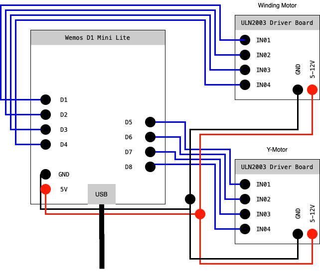

# em-winder

EM-winder is a fully open source, 3d-printable and very cheap electromagnet winder. 
As many hobby tinkerers most likely already had to painfully find out, winding a ton of electromagnets is not all that fun.
To speed up the process for future projects I designed EM-winder.

Chears and keep hacking.

## 3d-prints

Print out all the files in the folder stl once.
Support is needed for the inside of the "body.stl" file. 
"wire-guide.stl" has to be glued to the "body.stl" depending on where you wire spool is located.

## Electronics

**Microcontroller:** Wemos D1 Mini Lite
**Motors:** 28BYJ-48 Stepper Motor with a ULN2003 Driver Board

**Schematics:**

## Software

Install library "ULN2003_StepperMotor_master" using the arduino-IDE. [How to](https://www.arduino.cc/en/guide/libraries#toc4)

Compile and load EM-Winder.ino onto your Wemos D1 Mini Lite. (Be sure to use the correct serial port, upload speed, ...)

